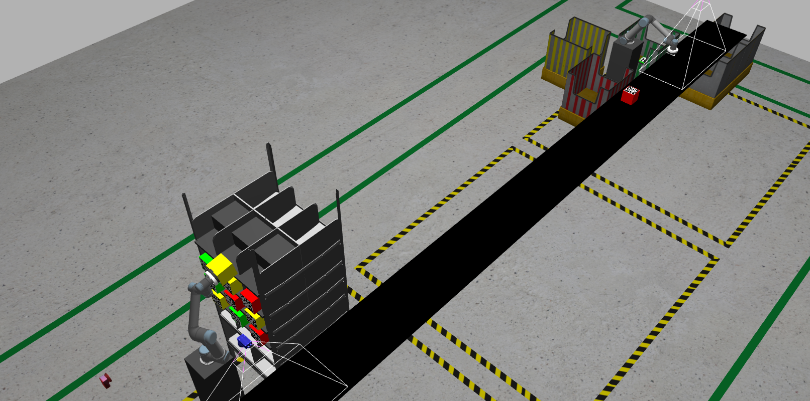

============
Introduction
============
.. sectnum::

    
   The task implementation in action in Gazebo.

The implementation of this task required the integration of many different systems across simulation, control, communication and programming libraries. The following is a brief overview of the various systems used:

* :ref:`Sim`

  * :ref:`ROS`
  * :ref:`Moveit`

* :ref:`IoT`

  * :ref:`MQTT`
  * :ref:`Google`

-----------------

.. _Sim:

Simulation
----------
Any simulation implementation requires a robust visualisation and integration environment. The following systems and resources were utilised in the task:

.. _ROS:

ROS and Gazebo
++++++++++++++
ROS is the middleware responsible for tying in the most important aspects of the task, namely the two robotic arms controller and the simulation environment. Coupled with Gazebo, the primary simulation environment for ROS applications, a complete simulation and control application can be modeled.

.. _Moveit:

MoveIt! and RViz
++++++++++++++++
The MoveIt! Motion Planning framework enables the two robotic arms to conduct autonemous path planning and pick-place operations. Coupled with RViz, it's primary visualisation environment, the two companion cameras with the robots can be used to see the world through the robots' eyes and perform tasks.

---------------

.. _IoT:

IoT Communication
-----------------
Communication is important to coordinate multiple agents in a single simulation, and also to maintain the front-end required from the 'client' in this task. The following integrations were used:

.. _MQTT:

MQTT Protocol
+++++++++++++
The Message Queuing Telemetry Transport Protocol is a low-bandwidth and footprint protocol that enables light communication pipelines exspecially in remote locations like the warehouse in this task. It is also used to communicate with the server from which the client will be sending orders.

.. _Google:

Gsuite (Sheets and Email)
+++++++++++++++++++++++++
The front-end interaction of emails to the client and back-end database management was achieved using Google Sheets and Gmail, incorporating Google Sheet Scripts to automate the sheet and dashboard updation as well as the email dispatch.
